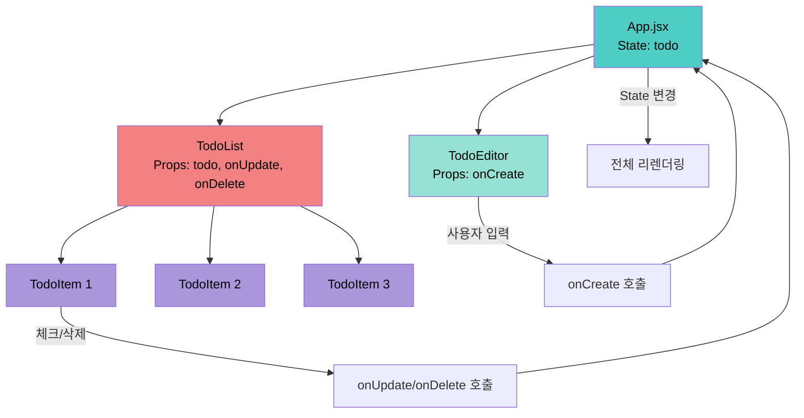
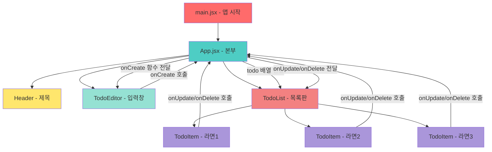

# 🍜 라면 Todo 앱 - 핵심 개념 정리

중학생도 이해할 수 있게 중요한 부분만 쏙쏙 골라서 설명할게요!

---

## 📊 전체 구조도


---

## 🎯 핵심 개념 4가지

### 1. **컴포넌트 (Component)** = 레고 블록 🧱
- UI를 만드는 재사용 가능한 조각들이에요
- 이 앱의 컴포넌트: `Header`, `TodoEditor`, `TodoList`, `TodoItem`

### 2. **State (상태)** = 컴포넌트의 기억력 🧠
- `useState`로 만들어요
- 값이 바뀌면 화면이 자동으로 다시 그려져요
- 예: `const [todo, setTodo] = useState([])`

### 3. **Props (속성)** = 부모가 자식에게 주는 선물 🎁
- 부모 컴포넌트가 자식 컴포넌트에게 데이터나 함수를 전달해요
- 예: `<TodoEditor onCreate={onCreate} />`

### 4. **이벤트 (Event)** = 사용자 행동에 반응 🖱️
- `onClick`, `onChange`, `onKeyDown` 등
- 버튼 클릭, 입력 등에 반응해서 함수를 실행해요

---

## 1️⃣ `main.jsx` - 앱 시작점 ⚡

```jsx
createRoot(document.getElementById('root')).render(<App />)
```

### 핵심 요점
- **역할**: React 앱을 HTML의 `root` 요소에 붙여주는 입구예요
- **비유**: 전원 버튼을 눌러서 앱을 켜는 것!

---

## 2️⃣ `App.jsx` - 본부 대장 🏢

### 핵심 요점

#### 📦 **State 관리** - 데이터 저장소
```jsx
const [todo, setTodo] = useState(mockTodo);  // 라면 목록 저장
const idRef = useRef(3);  // 다음 ID 번호 기억
```
- `todo`: 전체 라면 목록 (배열)
- `setTodo`: 목록을 업데이트하는 함수
- `useRef`: 화면 새로고침 없이 값만 기억

#### ⚡ **3가지 핵심 함수**

**1. 추가 (onCreate)**
```jsx
const onCreate = (content) => {
  const newItem = { id, isDone: false, content, createDate }
  setTodo([...todo, newItem])  // 기존 배열에 새 항목 추가
  idRef.current += 1
}
```
- **핵심**: `[...todo, newItem]` → 기존 배열 복사 + 새 항목 추가
- **스프레드 연산자 `...`**: 배열의 모든 요소를 펼쳐놓는 문법

**2. 수정 (onUpdate)**
```jsx
const onUpdate = (targetId) => {
  setTodo(
    todo.map(it => 
      it.id === targetId ? {...it, isDone: !it.isDone} : it
    )
  )
}
```
- **핵심**: `map`으로 배열을 순회하며 특정 ID의 `isDone`만 반대로 변경
- **삼항 연산자**: `조건 ? 참일때 : 거짓일때`

**3. 삭제 (onDelete)**
```jsx
const onDelete = (targetId) => {
  setTodo(todo.filter(it => it.id !== targetId))
}
```
- **핵심**: `filter`로 targetId가 아닌 항목들만 남겨서 새 배열 생성

#### 🔗 **Props 전달**
```jsx
<TodoEditor onCreate={onCreate} />
<TodoList todo={todo} onUpdate={onUpdate} onDelete={onDelete} />
```
- 자식 컴포넌트들에게 필요한 데이터와 함수를 전달

---

## 3️⃣ `Header.jsx` - 간판 🪧

```jsx
const Header = () => (
  <div>
    <h3>오늘은 내가 짜파게티 요리사🍜</h3>
    <h1>{new Date().toDateString()}</h1>
  </div>
)
```

### 핵심 요점
- **역할**: 제목과 현재 날짜만 표시
- **특징**: State도 Props도 없는 가장 단순한 컴포넌트
- **JSX 문법**: `{}`안에 JavaScript 코드 실행 가능

---

## 4️⃣ `TodoEditor.jsx` - 입력 창 ✍️

### 핵심 요점

#### 📝 **제어 컴포넌트 (Controlled Component)**
```jsx
const [content, setContent] = useState("")

<input 
  value={content}                    // State와 연결
  onChange={(e) => setContent(e.target.value)}  // 입력마다 State 업데이트
/>
```
- **핵심**: input의 값을 React State가 완전히 제어해요
- `value={content}`: 입력창의 값 = State
- `onChange`: 사용자 입력 → State 업데이트

#### ✅ **유효성 검사**
```jsx
const onSubmit = () => {
  if(!content) {
    inputRef.current.focus()  // 빈칸이면 포커스만
    return
  }
  onCreate(content)  // 내용이 있으면 추가
  setContent("")     // 입력창 초기화
}
```
- **핵심**: 빈 문자열 체크로 무의미한 추가 방지

#### ⌨️ **키보드 이벤트**
```jsx
const onKeyDown = (e) => {
  if(e.keyCode === 13) onSubmit()  // 엔터(13) = 추가
}
```
- 엔터키로도 추가 가능하게!

---

## 5️⃣ `TodoList.jsx` - 목록 게시판 📋

### 핵심 요점

#### 🔍 **검색 기능**
```jsx
const [search, setSearch] = useState("")

const getSearchResult = () => 
  search === "" ? todo : 
  todo.filter(it => it.content.toLowerCase().includes(search.toLowerCase()))
```
- **핵심**: 검색어가 있으면 필터링, 없으면 전체 표시
- `toLowerCase()`: 대소문자 구분 없이 검색

#### 🔁 **배열 렌더링**
```jsx
{getSearchResult().map(it => (
  <TodoItem key={it.id} {...it} onUpdate={onUpdate} onDelete={onDelete} />
))}
```
- **map**: 배열의 각 요소를 컴포넌트로 변환
- **key**: React가 각 항목을 구분하는 고유값 (필수!)
- **스프레드 `{...it}`**: `it`의 모든 속성을 props로 한번에 전달
  - `{...it}` = `id={it.id} content={it.content} isDone={it.isDone} createDate={it.createDate}`

---

## 6️⃣ `TodoItem.jsx` - 라면 카드 🎴

### 핵심 요점

```jsx
const TodoItem = ({id, content, isDone, createDate, onUpdate, onDelete}) => (
  <div className='TodoItem'>
    <input type="checkbox" 
      checked={isDone} 
      onClick={() => onUpdate(id)} />
    <div>{content}</div>
    <div>{new Date(createDate).toLocaleDateString()}</div>
    <button onClick={() => onDelete(id)}>🗑️</button>
  </div>
)
```

#### ⚡ **이벤트 핸들러**
- `onClick={() => onUpdate(id)}`: 화살표 함수로 ID를 전달
- **왜 화살표 함수?**: `onClick={onUpdate(id)}`로 쓰면 렌더링할 때 바로 실행돼요!
- `() =>` 감싸면 클릭할 때만 실행됩니다

---

## 🔄 데이터 흐름도



### 데이터 흐름 정리
1. **아래로 흐름** (Props): `App` → `TodoList` → `TodoItem`
2. **위로 흐름** (이벤트): `TodoItem` → 함수 호출 → `App`의 State 변경
3. **순환**: State 변경 → 리렌더링 → 새 Props 전달

---

## 💡 중요한 React 문법 정리

### ✨ **스프레드 연산자 `...`**
```jsx
[...todo, newItem]        // 배열 복사 + 추가
{...it, isDone: true}     // 객체 복사 + 속성 변경
```

### 🔄 **배열 메서드**
```jsx
todo.map(it => ...)       // 각 요소 변환
todo.filter(it => ...)    // 조건에 맞는 것만
```

### 🎯 **조건부 렌더링**
```jsx
{todos.map(it => <TodoItem />)}  // 배열 → JSX 변환
```

### 🔑 **구조 분해 할당**
```jsx
const TodoItem = ({id, content}) => {...}  // Props 바로 추출
```

---

## 🎯 실제 동작 시나리오

### 📝 라면 추가 과정
1. 사용자가 입력창에 "불닭볶음면" 입력
2. "추가" 버튼 클릭 → `onSubmit()` 실행
3. `onCreate("불닭볶음면")` 호출 (App으로 전달)
4. App에서 `setTodo([...todo, newItem])` 실행
5. State 변경 → 자동 리렌더링
6. TodoList가 새 todo 받음 → TodoItem 하나 더 생성!

### ✅ 체크 토글 과정
1. "짜파게티" 체크박스 클릭
2. `onUpdate(1)` 호출 (ID=1)
3. App에서 `todo.map`으로 ID 1인 항목의 `isDone`만 반대로
4. State 변경 → 리렌더링
5. 체크박스 상태 변경!

---

## 🎨 핵심 정리

### 이 앱의 구조
- **main.jsx**: 앱 시작점
- **App.jsx**: 모든 State와 로직을 관리하는 중앙 본부
- **Header**: 단순 표시용
- **TodoEditor**: 입력 담당 (onCreate 사용)
- **TodoList**: 목록 표시 + 검색 (todo, onUpdate, onDelete 사용)
- **TodoItem**: 개별 항목 표시 (Props 받아서 화면만 그림)

### React 핵심 원칙
1. **단방향 데이터 흐름**: Props는 위→아래만
2. **State 불변성**: 직접 수정 금지, 새 배열/객체 생성
3. **컴포넌트 재사용**: 작은 단위로 쪼개기
4. **선언적 UI**: "어떻게"가 아닌 "무엇을" 그릴지만 정의

이해되셨나요? 😊

---

## 🔄 데이터 흐름 정리



---

## 💡 핵심 개념 정리

### 1. **컴포넌트**: 레고 블록처럼 조립 가능한 UI 조각
- `Header`, `TodoEditor`, `TodoList`, `TodoItem` 모두 컴포넌트예요.

### 2. **Props**: 부모가 자식에게 주는 선물 🎁
- `App` → `TodoEditor`에게 `onCreate` 전달
- `App` → `TodoList`에게 `todo`, `onUpdate`, `onDelete` 전달
- `TodoList` → `TodoItem`에게 라면 정보 전달

### 3. **State**: 컴포넌트가 기억하는 데이터 🧠
- `App`의 `todo`: 전체 라면 목록
- `TodoEditor`의 `content`: 입력 중인 글자
- `TodoList`의 `search`: 검색어

### 4. **이벤트**: 사용자 행동에 반응 🖱️
- `onClick`: 클릭했을 때
- `onChange`: 입력 내용 바뀔 때
- `onKeyDown`: 키보드 눌렀을 때

---

## 🎯 전체 동작 시나리오

### 📝 라면 추가하기
1. 사용자가 `TodoEditor` 입력 창에 "불닭볶음면" 입력
2. "추가" 버튼 클릭
3. `onCreate("불닭볶음면")` 호출
4. `App`에서 새 라면 객체 생성
5. `setTodo`로 `todo` 배열에 추가
6. `TodoList`가 새로운 `todo`를 받음
7. 새 `TodoItem` 생성되어 화면에 표시!

### ✅ 라면 체크하기
1. 사용자가 "짜파게티" 체크박스 클릭
2. `TodoItem`에서 `onUpdate(1)` 호출 (ID가 1)
3. `App`에서 ID 1인 라면의 `isDone`을 반대로 바꿈
4. `setTodo`로 `todo` 업데이트
5. `TodoList` → `TodoItem` 다시 그려짐
6. 체크박스에 ✓ 표시!

### 🗑️ 라면 삭제하기
1. 사용자가 "신라면" 삭제 버튼 클릭
2. `TodoItem`에서 `onDelete(2)` 호출 (ID가 2)
3. `App`에서 ID 2인 라면을 `filter`로 제거
4. `setTodo`로 `todo` 업데이트
5. "신라면"이 사라진 새 목록이 화면에 표시!

---

## 🎨 마지막 정리

이 앱은 **6개의 컴포넌트**로 이루어진 **라면 관리 프로그램**이에요!

- **main.jsx**: 앱 시작 (전원 ON!)
- **App.jsx**: 모든 데이터와 기능을 관리하는 본부
- **Header.jsx**: 제목과 날짜를 보여주는 간판
- **TodoEditor.jsx**: 새 라면을 입력하는 창
- **TodoList.jsx**: 라면 목록을 보여주고 검색하는 게시판
- **TodoItem.jsx**: 라면 하나하나를 표시하는 카드

**데이터는 App에서 관리**하고, **다른 컴포넌트들은 필요한 정보와 함수를 받아서 사용**해요!

모든 코드 한 줄 한 줄 이해되셨나요? 😊
