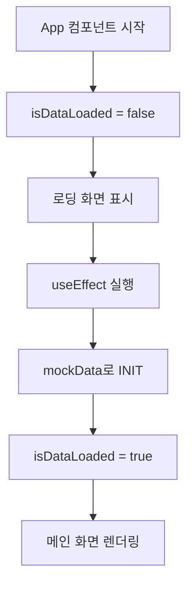
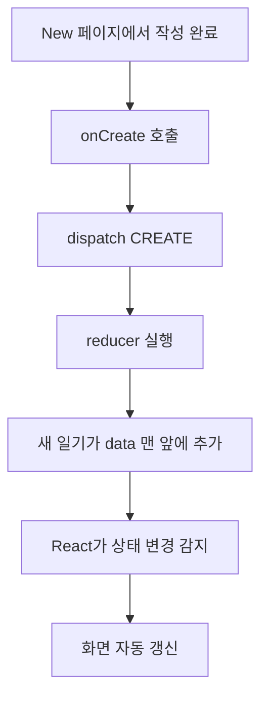
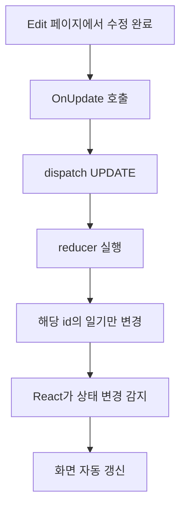
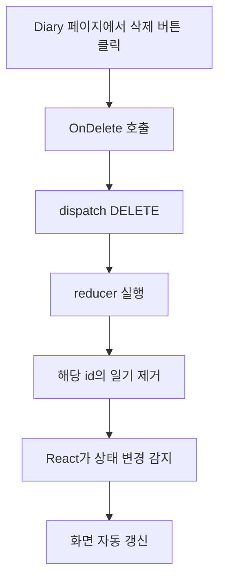

# React App.jsx 상세 설명서

## 📦 Import 부분

```javascript
import { Link, NavLink, Route, Routes } from 'react-router-dom';
import './App.css';
import Home from './page/Home';
import New from './page/New';
import Diary from './page/Diary';
import Edit from './page/Edit';
import React, { useEffect, useReducer, useRef, useState } from 'react';
```

- **react-router-dom**: 페이지 간 이동을 위한 라이브러리
  - `Routes`, `Route`: 경로 설정
  - `Link`: 페이지 이동 링크
- **페이지 컴포넌트들**: Home, New, Diary, Edit - 각 화면을 담당
- **React Hooks**: 
  - `useEffect`: 컴포넌트 실행 시 특정 작업 수행
  - `useReducer`: 복잡한 상태 관리
  - `useRef`: 값을 유지하는 참조
  - `useState`: 상태 관리

---

## 🔄 reducer 함수 (상태 관리의 핵심)

```javascript
function reducer(state, action){
  switch(action.type){
    case "CREATE": {...}
    case "UPDATE": {...}
    case "DELETE": {...}
    case "INIT": {...}
    default: {...}
  }
}
```

**reducer는 "상태를 어떻게 변경할지" 정의하는 함수**입니다.

### 1️⃣ CREATE (새 일기 추가)

```javascript
case "CREATE":{
  return [action.data, ...state]
}
```

- 새로운 일기(`action.data`)를 배열 맨 앞에 추가
- `...state`: 기존 일기들을 뒤에 배치

### 2️⃣ UPDATE (일기 수정)

```javascript
case "UPDATE":{
  return state.map( (it)=> 
    String(it.id) === String(action.data.id) ? {...action.data} : it
  );
}
```

- `map`으로 모든 일기를 순회
- id가 일치하는 일기만 새 데이터로 교체
- 나머지는 그대로 유지

### 3️⃣ DELETE (일기 삭제)

```javascript
case "DELETE":{
  return state.filter( (it)=> String(it.id) !== String(action.targetId))
}
```

- `filter`: 조건에 맞는 것만 남김
- 삭제할 id와 다른 것들만 남겨서 반환
- **filter 동작 원리**: 배열의 각 요소를 검사해서 조건이 `true`인 것만 새 배열로 만듦

### 4️⃣ INIT (초기 데이터 로드)

```javascript
case "INIT":{
  return action.data;
}
```

- 처음 앱 시작 시 데이터를 설정

---

## 📝 mockData (임시 데이터)

```javascript
const mockData = [
  {
    id : "mock1",
    date : new Date().getTime(),  // 현재 시간을 밀리초로
    content : "mock1",
    emotionId : 1
  },
  {
    id : "mock2",
    date : new Date().getTime(),
    content : "mock2",
    emotionId : 2
  },
  {
    id : "mock3",
    date : new Date().getTime(),
    content : "mock3",
    emotionId : 3
  }
];
```

- 앱 테스트용 샘플 데이터
- 각 일기는 `id`, `date`, `content`, `emotionId`를 가짐
- `new Date().getTime()`: 1970년 1월 1일부터 현재까지의 밀리초

---

## 🌐 Context 생성

```javascript
export const DiaryStateContext = React.createContext();
export const DiaryDispatchContext = React.createContext();
```

**Context는 "데이터를 자식 컴포넌트에게 전달하는 통로"**입니다.

- **DiaryStateContext**: 일기 데이터(읽기 전용)
- **DiaryDispatchContext**: 일기 조작 함수들(onCreate, OnUpdate, OnDelete)

### Context를 사용하는 이유

props를 여러 단계로 내려주지 않고도 모든 자식 컴포넌트에서 데이터와 함수에 접근할 수 있습니다.

```
App (데이터 보유)
  ↓ Context로 전달
Home, New, Diary, Edit (어디서든 접근 가능)
```

---

## 🏗️ App 컴포넌트 내부

### 1️⃣ 상태 선언

```javascript
const [data, dispatch] = useReducer(reducer, []);
const [isDataLoaded, setIsDataLoaded] = useState(false);
const idRef = useRef(0);
```

- `data`: 모든 일기 데이터 배열
- `dispatch`: reducer를 호출하는 함수
- `isDataLoaded`: 데이터 로딩 완료 여부
- `idRef`: 새 일기의 고유 번호 (증가하는 값)

#### useRef의 특징

- 컴포넌트가 리렌더링되어도 값이 유지됨
- 값이 변경되어도 리렌더링이 발생하지 않음
- ID 카운터처럼 "증가하기만 하는 값"에 적합

### 2️⃣ 초기 데이터 로드

```javascript
useEffect( ()=> {
  dispatch({
    type : "INIT",
    data : mockData
  });
  setIsDataLoaded(true);
},[]);
```

- 컴포넌트가 처음 렌더링될 때 **한 번만** 실행 (`[]` 의존성 배열)
- mockData를 초기 데이터로 설정
- 로딩 완료 표시

---

## ⚙️ CRUD 함수들

### ✍️ onCreate (일기 생성)

```javascript
const onCreate = ({date, content, emotionId}) => {
  dispatch({
    type : "CREATE",
    data : {
      id : idRef.current,           // 현재 ID 사용
      date : new Date(date).getTime(),
      content : content,
      emotionId : emotionId
    }
  });
  idRef.current += 1;  // ID 1 증가
};
```

**작동 순서:**

1. 매개변수로 날짜, 내용, 감정 받음
2. 현재 `idRef` 값으로 고유 ID 부여
3. reducer의 CREATE 케이스 실행
4. 다음 일기를 위해 ID를 1 증가

**예시:**

```javascript
// New 페이지에서 이렇게 호출
onCreate({
  date: "2024-12-09",
  content: "오늘은 좋은 날!",
  emotionId: 1
});

// 결과: id가 0인 새 일기가 data 배열 맨 앞에 추가됨
```

### 🔧 OnUpdate (일기 수정)

```javascript
const OnUpdate = ({id, date, content, emotionId}) => {
  dispatch({
    type : "UPDATE",
    data : {
      id : id,
      date : new Date(date).getTime(),
      content,
      emotionId
    }
  });
};
```

- 수정할 일기의 `id`와 새로운 정보를 받음
- reducer의 UPDATE 케이스로 해당 일기만 수정
- 다른 일기들은 그대로 유지

**예시:**

```javascript
// Edit 페이지에서 이렇게 호출
OnUpdate({
  id: "mock1",
  date: "2024-12-10",
  content: "수정된 내용",
  emotionId: 3
});

// 결과: id가 "mock1"인 일기만 새 내용으로 변경됨
```

### 🗑️ OnDelete (일기 삭제)

```javascript
const OnDelete = (targetId) => {
  dispatch({
    type : "DELETE",
    targetId
  })
}
```

- 삭제할 일기의 `id`만 받음
- reducer의 DELETE 케이스로 해당 일기 제거

**예시:**

```javascript
// Diary 페이지에서 이렇게 호출
OnDelete("mock2");

// 결과: id가 "mock2"인 일기가 data 배열에서 사라짐
```

---

## 🎨 렌더링 부분

### 로딩 중 화면

```javascript
if(!isDataLoaded){
  return <div>데이터를 불러오는 중입니다</div>
}
```

- 데이터가 아직 로드되지 않았으면 로딩 메시지 표시
- `useEffect`가 실행되기 전까지는 이 화면이 보임

### 메인 화면

```javascript
else{
  return (
    <DiaryStateContext.Provider value={data}>
      <DiaryDispatchContext.Provider value={{onCreate, OnUpdate, OnDelete}}>
        <div className="App">
          <Routes>
            <Route path='/' element={<Home />} />
            <Route path='/new' element={<New/>} />
            <Route path='/diary/:id' element={<Diary/>} />
            <Route path='/edit/:id' element={<Edit/>} />
          </Routes>
          <div>
            <Link to={"/"}>Home</Link> 
            <Link to={"/new"}>New</Link>
            <Link to={"/diary"}>Diary</Link>
            <Link to={"/edit"}>Edit</Link>
          </div>
        </div>
      </DiaryDispatchContext.Provider>
    </DiaryStateContext.Provider>
  );
}
```

**Context Provider 계층:**

1. `DiaryStateContext.Provider`: 모든 일기 데이터(`data`)를 하위 컴포넌트에 제공
2. `DiaryDispatchContext.Provider`: CRUD 함수들을 하위 컴포넌트에 제공

### 라우팅 설정

| 경로 | 컴포넌트 | 설명 |
|------|---------|------|
| `/` | `<Home />` | 홈 화면 (일기 목록) |
| `/new` | `<New/>` | 새 일기 작성 |
| `/diary/:id` | `<Diary/>` | 특정 일기 상세보기 (`:id`는 일기 번호) |
| `/edit/:id` | `<Edit/>` | 특정 일기 수정 |

**동적 라우팅 예시:**

- `/diary/mock1` → id가 "mock1"인 일기 보기
- `/edit/mock2` → id가 "mock2"인 일기 수정

### 네비게이션 링크

```javascript
<div>
  <Link to={"/"}>Home</Link> 
  <Link to={"/new"}>New</Link>
  <Link to={"/diary"}>Diary</Link>
  <Link to={"/edit"}>Edit</Link>
</div>
```

- 각 페이지로 이동할 수 있는 링크들
- `Link`는 새로고침 없이 페이지 전환 (SPA 방식)

---

## 🔄 전체 동작 흐름 정리

### 앱 시작 시



### 새 일기 작성 시



### 일기 수정 시



### 일기 삭제 시



---

## 💡 핵심 개념 요약

| 개념 | 역할 | 사용 이유 |
|------|------|-----------|
| **useReducer** | 복잡한 상태 관리 (일기 배열) | 여러 종류의 상태 변경을 체계적으로 관리 |
| **Context API** | 데이터를 모든 자식에게 전달 | props drilling 방지 |
| **useRef** | 컴포넌트가 리렌더링되어도 유지되는 값 | ID 카운터처럼 증가하는 값 관리 |
| **React Router** | 페이지 라우팅 | SPA에서 페이지 전환 구현 |
| **dispatch** | reducer 함수를 실행하는 트리거 | 상태 변경 요청 |

---

## 🎯 자식 컴포넌트에서 사용하는 방법

### 상태(데이터) 가져오기

```javascript
import { useContext } from 'react';
import { DiaryStateContext } from '../App';

function Home() {
  const data = useContext(DiaryStateContext);
  
  // data를 사용해서 일기 목록 표시
  return (
    <div>
      {data.map((diary) => (
        <div key={diary.id}>{diary.content}</div>
      ))}
    </div>
  );
}
```

### 함수 가져오기

```javascript
import { useContext } from 'react';
import { DiaryDispatchContext } from '../App';

function New() {
  const { onCreate } = useContext(DiaryDispatchContext);
  
  const handleSubmit = () => {
    onCreate({
      date: "2024-12-09",
      content: "새 일기",
      emotionId: 1
    });
  };
  
  return <button onClick={handleSubmit}>저장</button>;
}
```

---

## 🔍 주요 메서드 상세 설명

### Array.map()

```javascript
const numbers = [1, 2, 3];
const doubled = numbers.map((num) => num * 2);
// 결과: [2, 4, 6]
```

- 배열의 각 요소를 변환해서 **새 배열**을 만듦
- UPDATE에서 특정 일기만 변경할 때 사용

### Array.filter()

```javascript
const numbers = [1, 2, 3, 4, 5];
const evens = numbers.filter((num) => num % 2 === 0);
// 결과: [2, 4]
```

- 조건에 맞는 요소만 남긴 **새 배열**을 만듦
- DELETE에서 특정 일기를 제외할 때 사용

### 스프레드 연산자 (...)

```javascript
const arr1 = [1, 2];
const arr2 = [3, 4];
const combined = [...arr1, ...arr2];
// 결과: [1, 2, 3, 4]
```

- 배열이나 객체를 펼쳐서 새로운 배열/객체를 만듦
- CREATE에서 기존 일기들을 유지하면서 새 일기를 추가할 때 사용

---

## 🚀 실전 예시

### 시나리오: 사용자가 새 일기를 작성하는 과정

1. **사용자**: "새 일기" 링크 클릭
2. **React Router**: `/new` 경로로 이동, `New` 컴포넌트 렌더링
3. **사용자**: 일기 내용 입력 후 저장 버튼 클릭
4. **New 컴포넌트**: `onCreate` 함수 호출
5. **onCreate**: `dispatch({ type: "CREATE", data: {...} })` 실행
6. **reducer**: CREATE 케이스 실행, 새 일기를 배열 맨 앞에 추가
7. **React**: 상태 변경 감지, 관련 컴포넌트 리렌더링
8. **화면**: 새 일기가 목록에 나타남

---

## 📚 추가 학습 포인트

### 1. reducer를 사용하는 이유

```javascript
// useState만 사용하는 경우 (복잡함)
const [data, setData] = useState([]);

const onCreate = (newDiary) => {
  setData([newDiary, ...data]);  // CREATE
};

const onUpdate = (updatedDiary) => {
  setData(data.map(d => d.id === updatedDiary.id ? updatedDiary : d));  // UPDATE
};

const onDelete = (id) => {
  setData(data.filter(d => d.id !== id));  // DELETE
};
```

```javascript
// useReducer 사용 (체계적)
const [data, dispatch] = useReducer(reducer, []);

// 모든 상태 변경 로직이 reducer에 집중됨
dispatch({ type: "CREATE", data: newDiary });
dispatch({ type: "UPDATE", data: updatedDiary });
dispatch({ type: "DELETE", targetId: id });
```

**useReducer의 장점:**

- 상태 변경 로직을 한 곳에 모음
- 복잡한 상태 관리가 명확해짐
- 디버깅이 쉬움 (어떤 action이 실행됐는지 추적 가능)

### 2. Context API vs Props Drilling

```javascript
// Props Drilling (비추천)
App → Home → DiaryList → DiaryItem
    (prop 4번 전달)

// Context API (추천)
App → Context Provider
       ↓
    DiaryItem (바로 접근)
```

### 3. String() 변환을 하는 이유

```javascript
String(it.id) === String(action.data.id)
```

- `id`가 숫자일 수도 있고 문자열일 수도 있음
- 타입이 달라도 비교할 수 있도록 둘 다 문자열로 변환
- 예: `1 === "1"` (false) vs `"1" === "1"` (true)

---

## 🎓 정리

이 `App.jsx`는 일기장 애플리케이션의 **두뇌** 역할을 합니다:

✅ **상태 관리**: useReducer로 모든 일기 데이터 관리  
✅ **전역 공유**: Context API로 데이터와 함수를 모든 페이지에 제공  
✅ **라우팅**: React Router로 페이지 전환 구현  
✅ **CRUD 기능**: 일기 생성, 조회, 수정, 삭제 함수 제공  

이 구조는 중~대규모 React 앱에서 자주 사용되는 **상태 관리 패턴**입니다! 🎉
